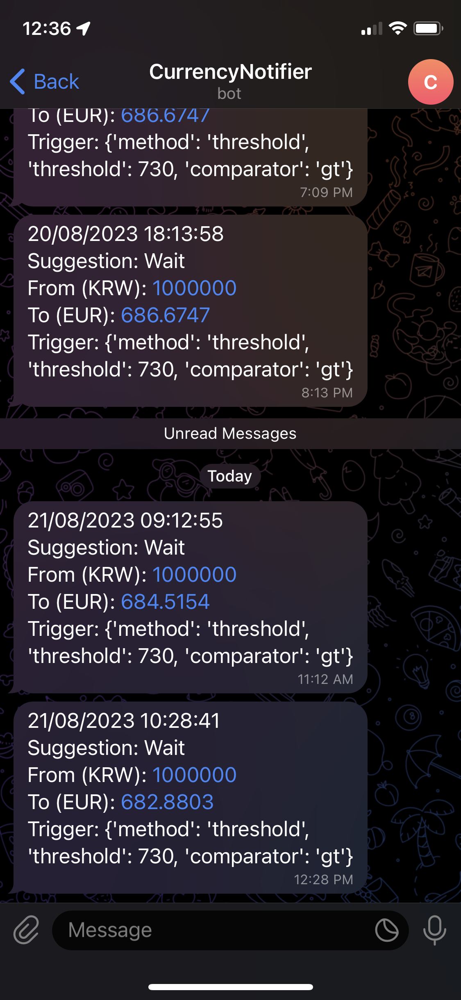

# Currency Notifier

It alerts the currency exchange rate via a messaging app (only Telegram Bot is supported currently.)

## Prerequisites

- Python 3.8+
  - [requests](https://pypi.org/project/requests/)
  - [python-telegram-bot](https://pypi.org/project/python-telegram-bot/)
- Telegram Bot
- API Credentials
  - [Geo API Key](https://currency.getgeoapi.com/) for checking the currency rate
  - Telegram Access Token for notification
